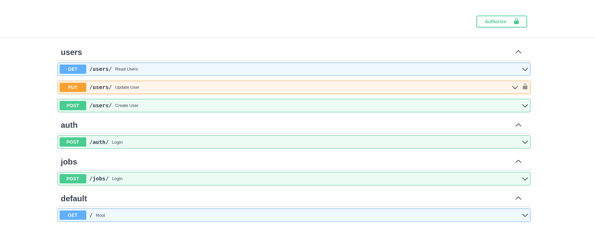

# Employment exchange

## Employment exchange - это API на FastAPI, c помощью которго работодатель может зарегистрироваться и выложить предложение о вакансии. А соискатель рассмотреть данное предложение.

# Сборка репозитория и локальный запуск

Выполните в консоли:

git clone https://github.com/Straigan/employment_exchange_fastapi.git  
pip install -r requirments.txt

## Запуск

Чтобы запустить web-приложение, выполните в консоли:  
docker-compose up  
python3 main.py